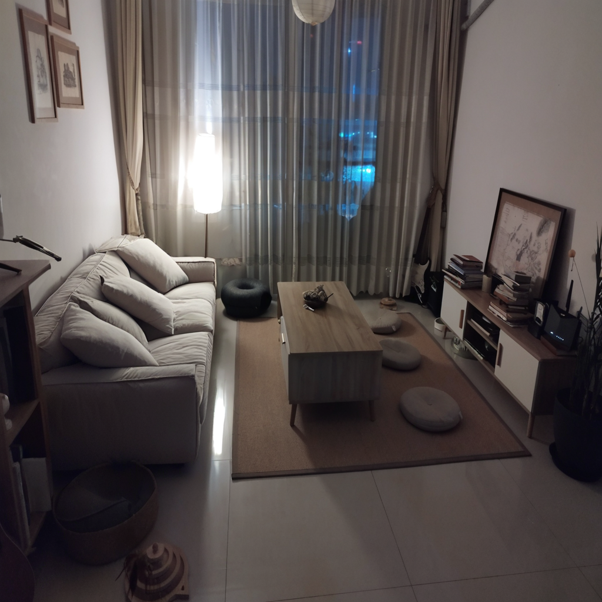
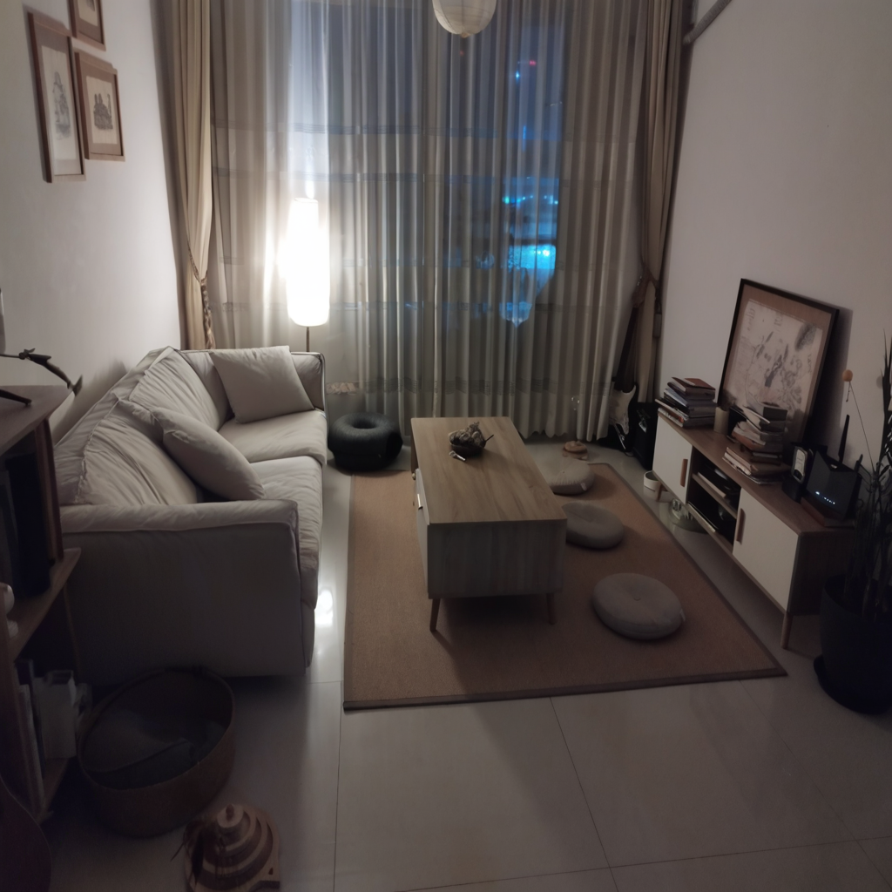
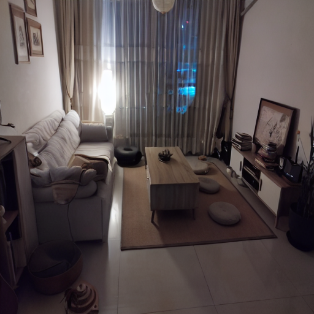
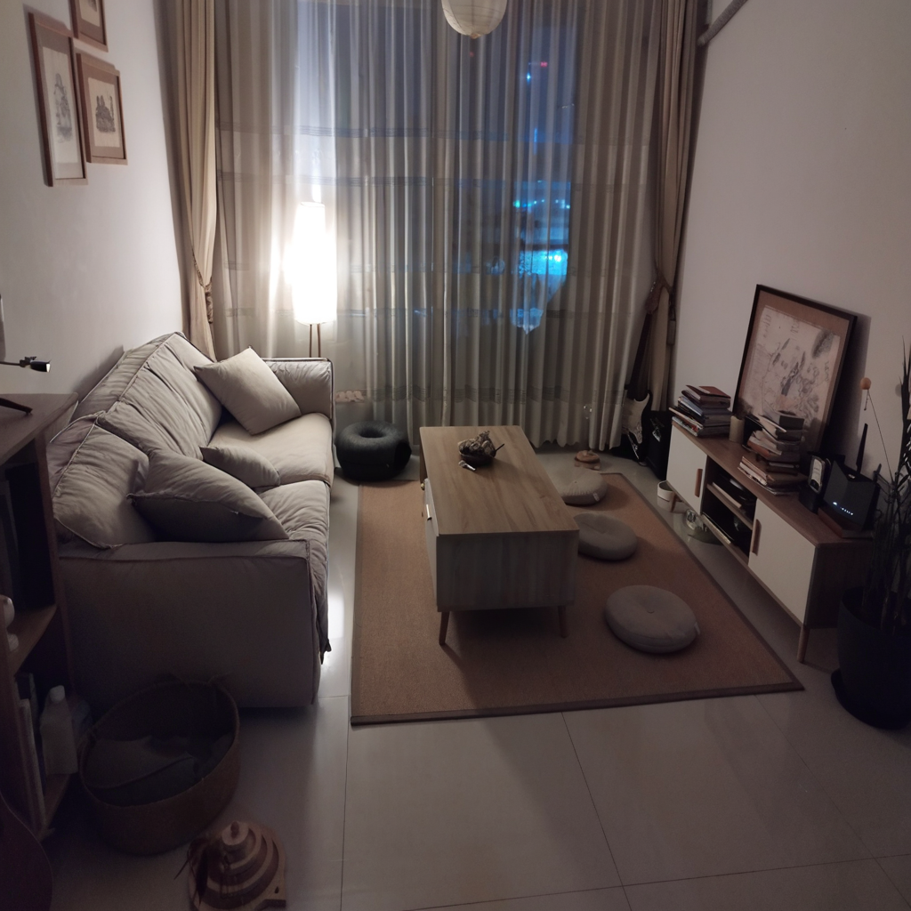
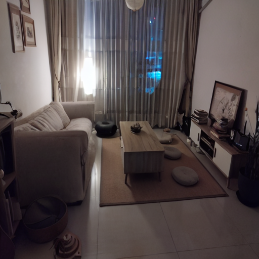
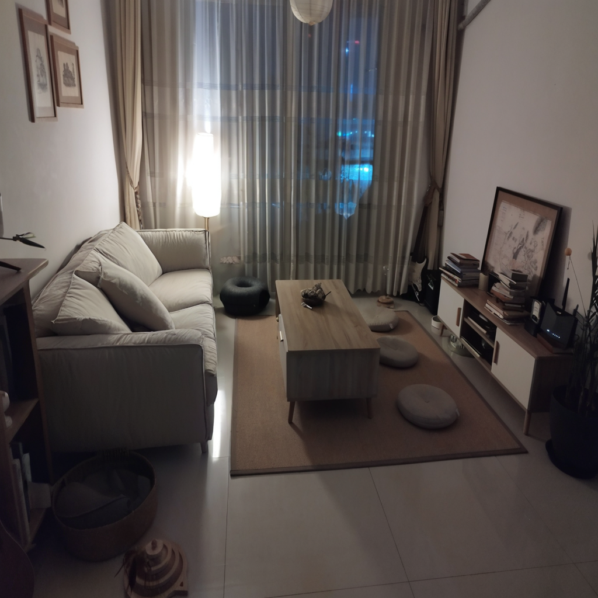
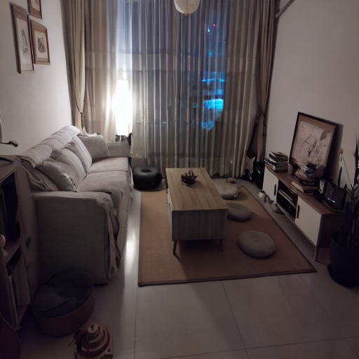

This repository contains code and examples for DreamBooth fine-tuning the [SDXL inpainting model's](https://huggingface.co/diffusers/stable-diffusion-xl-1.0-inpainting-0.1) UNet via LoRA adaptation. 
[DreamBooth](https://arxiv.org/abs/2208.12242) is a method to personalize text2image models like stable diffusion given just a few (3~5) images of a subject.

# Usage

1. Install the requirements
```bash
git clone https://github.com/nikgli/train-lora-sdxl-inpaint.git
cd train-lora-sdxl-inpaint/diffusers && pip install -e .
pip install -r train-lora-sdxl-inpaint/diffusers/examples/research_projects/requirements.txt
pip install -U "huggingface_hub[cli]"
```
2. Download the inpainting model
```bash
huggingface-cli download diffusers/stable-diffusion-xl-1.0-inpainting-0.1 --local-dir ./models/sdxl-inpainting-1.0 --local-dir-use-symlinks False
```
3. Place your subject images in `dataset/subdir` and run
```bash
accelerate launch examples/research_projects/dreambooth_inpaint/train_dreambooth_inpaint_lora_sdxl.py \
    --pretrained_model_name_or_path="./models/sdxl-inpainting-1.0" \
    --instance_data_dir="./dataset/your-subject-images-directory" \
    --output_dir="./lora-weights/sks-your-subject-sdxl-from-inpainting" \
    --instance_prompt="a photo of a sks dog" \
    --mixed_precision="fp16" \
    --resolution=1024 \
    --train_batch_size=1 \
    --gradient_accumulation_steps=4 \
    --learning_rate=1e-4 \
    --lr_scheduler="constant" \
    --lr_warmup_steps=0 \
    --max_train_steps=500 \
    --seed="42" \
```

Make sure to replace the directory names and unique identifiers accordingly. At least 16GB of VRAM is required for training.

# What this script does

This is a fork of the [diffusers](https://github.com/huggingface/diffusers) repository with the only difference being the addition of the `train_dreambooth_inpaint_lora_sdxl.py` script. You could use this script to fine-tune the SDXL inpainting model UNet via LoRA adaptation with your own subject images. This could be useful in e-commerce applications, for virtual try-on for example.

# Results

After running a few tests, arguably, doing dreambooth finetuning on the SDXL-inpaint model gives higher quality images than the proposed alternative with [SD inpainting model](https://huggingface.co/runwayml/stable-diffusion-inpainting)

<!-- Table with result images -->
| SDXL Inpainting | SD Inpainting |
|---|---|
|  |  |
|  |  |
|  |  |
|  |  |

# What this script maybe does

This script has only been tested for doing doing lora adaption for the unet of the SDXL inpainting model. Fine-tuning the text encoder(s) hasn't been tested. Feel free to try that out and provide feedback!

# What this script doesn't do and what you should probably never do
This script shouldn't be used for inpersonating anyone without their consent. The script also does not support any form of harmful or malicious use. It should not be used to create inappropriate or offensive content.